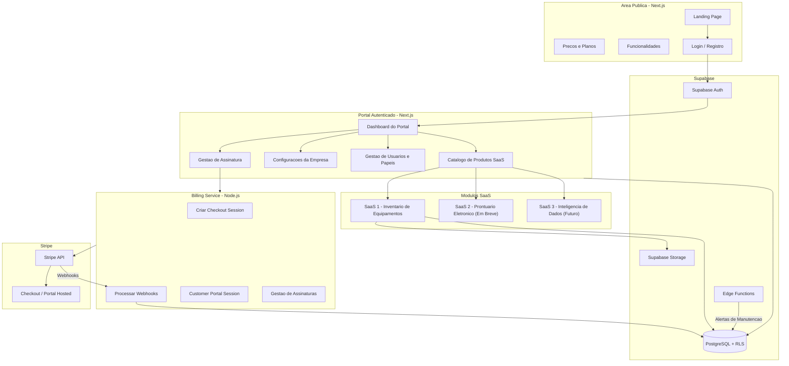
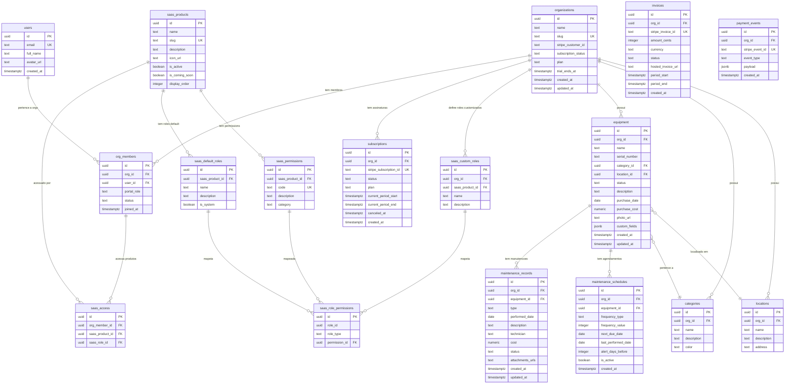
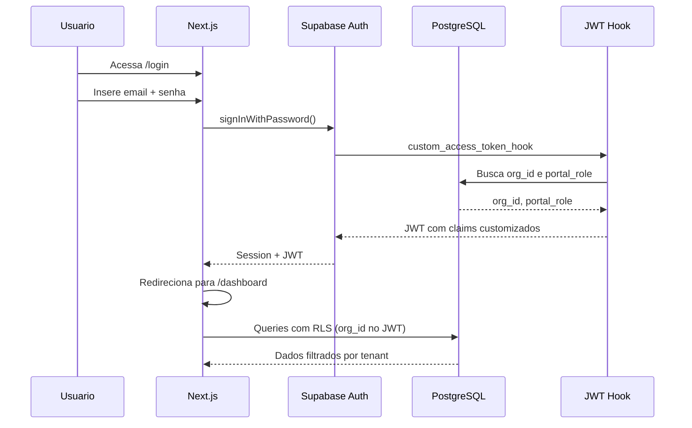
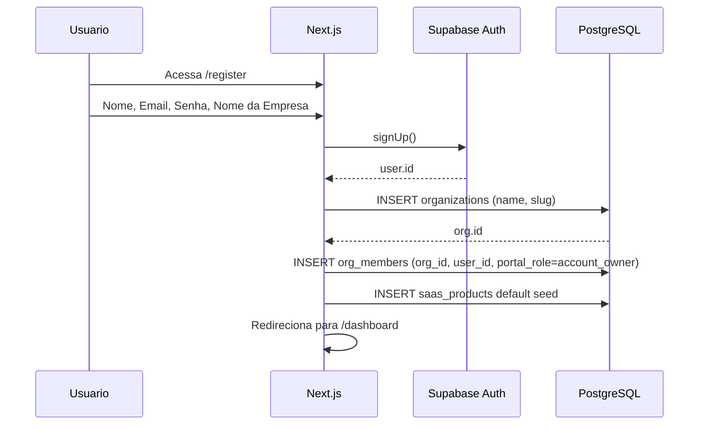
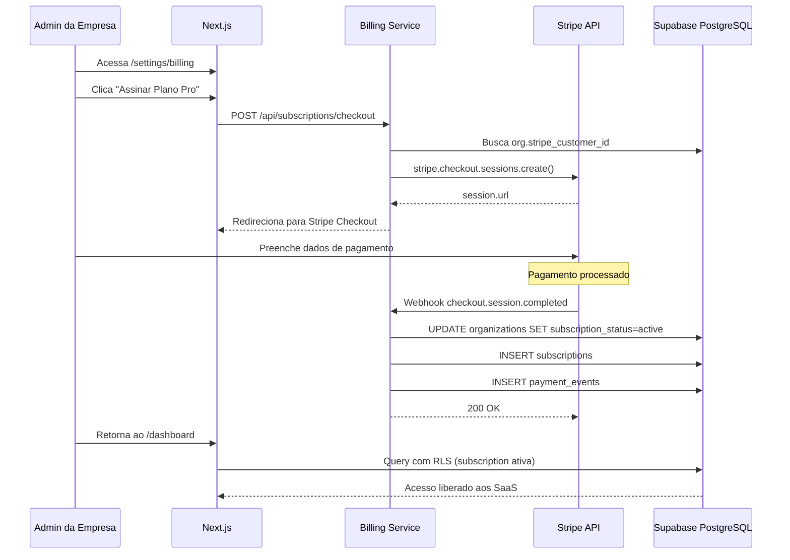
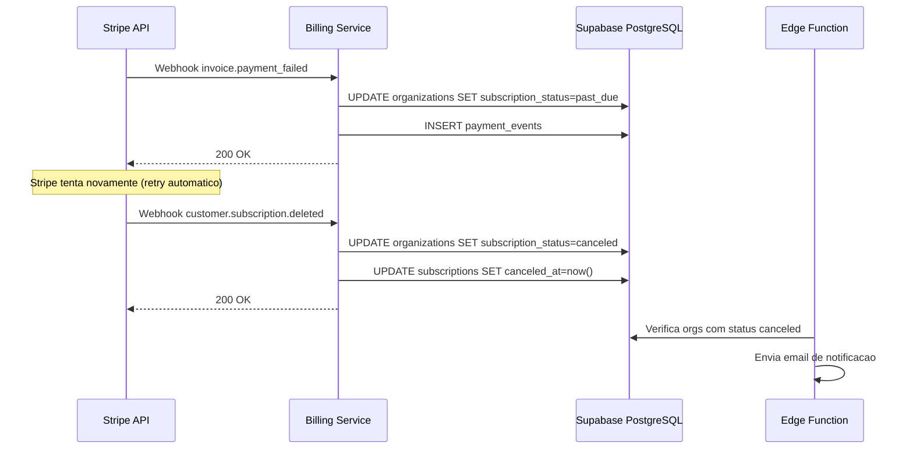

# Portal SaaS Multi-Produto — Arquitetura

## 1. Visao Geral do Sistema



---

## 2. Camadas do Sistema

### 2.1. Frontend — Next.js

Aplicacao unica Next.js servindo area publica e area autenticada.

| Rota | Tipo | Descricao |
|------|------|-----------|
| `/` | Publica | Landing page com proposta de valor |
| `/features` | Publica | Detalhamento das funcionalidades |
| `/pricing` | Publica | Planos e precos |
| `/login` | Publica | Login com Supabase Auth |
| `/register` | Publica | Registro + criacao de organizacao |
| `/forgot-password` | Publica | Recuperacao de senha |
| `/dashboard` | Autenticada | Dashboard do portal com catalogo de SaaS |
| `/settings` | Autenticada | Configuracoes da empresa (admin) |
| `/settings/users` | Autenticada | Gestao de usuarios e papeis (admin) |
| `/settings/billing` | Autenticada | Gestao de assinatura (admin) |
| `/equipment` | Autenticada | Lista de equipamentos (SaaS #1) |
| `/equipment/[id]` | Autenticada | Detalhe do equipamento |
| `/equipment/new` | Autenticada | Cadastro de equipamento |
| `/maintenance` | Autenticada | Registros de manutencao |
| `/maintenance/schedules` | Autenticada | Agendamentos recorrentes |
| `/reports` | Autenticada | Relatorios e dashboards |

### 2.2. Billing Service — Node.js / TypeScript

Microservico separado responsavel exclusivamente por billing. Nao processa logica de negocio dos SaaS.

**Endpoints:**

| Metodo | Rota | Descricao |
|--------|------|-----------|
| POST | `/api/subscriptions/checkout` | Cria sessao Stripe Checkout |
| POST | `/api/subscriptions/portal` | Cria sessao Stripe Customer Portal |
| GET | `/api/subscriptions/status/:orgId` | Consulta status da assinatura |
| POST | `/api/webhooks/stripe` | Recebe webhooks do Stripe |

**Responsabilidades:**
- Criar e gerenciar assinaturas via Stripe
- Processar webhooks (pagamento confirmado, falha, cancelamento)
- Atualizar status da organizacao no Supabase
- Registrar historico de faturas e eventos de pagamento
- Fila de retry para webhooks com falha

### 2.3. Supabase

| Servico | Uso |
|---------|-----|
| Auth | Autenticacao (email/senha, magic link, OAuth futuro) |
| PostgreSQL | Banco de dados principal com RLS |
| Storage | Fotos de equipamentos, anexos de manutencao |
| Edge Functions | Cron de alertas de manutencao, notificacoes |
| Realtime | Dashboard ao vivo (futuro) |

### 2.4. Stripe

| Recurso | Uso |
|---------|-----|
| Checkout | Pagina de pagamento hospedada |
| Subscriptions | Cobranca recorrente mensal |
| Customer Portal | Gestao de cartao, faturas, cancelamento pelo cliente |
| Webhooks | Notificacao de eventos (pagamento, falha, cancelamento) |
| Payment Methods | Cartao, Boleto, PIX (Brasil) |

---

## 3. Sistema de Permissoes — RBAC Dual

O sistema de permissoes e dividido em dois dominios independentes:

### 3.1. Portal Roles (Conta / Assinatura)

Controlam quem gerencia a conta, billing e usuarios. Sao poucos, fixos, e independem dos SaaS contratados.

| Portal Role | Gerenciar Assinatura | Gerenciar Usuarios | Ver Faturas | Descricao |
|-------------|---------------------|--------------------|-------------|-----------|
| `account_owner` | Sim | Sim | Sim | Criador da conta. Unico por org. |
| `account_admin` | Sim | Sim | Sim | Co-administrador da conta. |
| `billing_viewer` | Nao | Nao | Sim | Ve faturas, sem poder de gestao. |
| `member` | Nao | Nao | Nao | Membro comum. Acesso definido por SaaS Roles. |

Um usuario com portal_role `account_owner` pode nao ter acesso a nenhum SaaS — ele so paga a conta.

### 3.2. SaaS Roles e Permissions (Produto)

Controlam o que o usuario pode fazer dentro de cada produto SaaS. Sao granulares, flexiveis, e customizaveis por empresa.

**Permissions do SaaS #1 — Inventario de Equipamentos:**

| Codigo | Descricao |
|--------|-----------|
| `equipment.view` | Visualizar lista e detalhes de equipamentos |
| `equipment.create` | Cadastrar novos equipamentos |
| `equipment.edit` | Editar equipamentos existentes |
| `equipment.delete` | Remover equipamentos |
| `category.manage` | Criar, editar e remover categorias |
| `location.manage` | Criar, editar e remover localizacoes |
| `maintenance.view` | Visualizar registros de manutencao |
| `maintenance.create` | Registrar manutencoes realizadas |
| `maintenance.edit` | Editar registros de manutencao |
| `maintenance.delete` | Remover registros de manutencao |
| `schedule.view` | Visualizar agendamentos de manutencao |
| `schedule.manage` | Criar, editar e remover agendamentos |
| `reports.view` | Acessar relatorios e dashboards |

**Roles default do SaaS #1:**

| SaaS Role | Permissions |
|-----------|-------------|
| `saas_admin` | Todas as permissions do produto |
| `manager` | Todas exceto `*.delete` |
| `operator` | `equipment.view`, `equipment.create`, `equipment.edit`, `maintenance.view`, `maintenance.create`, `maintenance.edit`, `schedule.view` |
| `viewer` | `equipment.view`, `maintenance.view`, `schedule.view`, `reports.view` |

**Roles customizaveis:** cada empresa pode criar roles proprios com combinacao livre de permissions. Ex: "Tecnico Senior" com `maintenance.delete` mas sem `equipment.delete`.

### 3.3. Exemplo pratico

```
Empresa "Fabrica XYZ" — 5 usuarios:

Carlos (dono da empresa)
  Portal Role: account_owner
  SaaS Access: nenhum (so paga a conta)

Maria (gerente de manutencao)
  Portal Role: member
  SaaS Access: Inventario → saas_admin

Joao (tecnico)
  Portal Role: member
  SaaS Access: Inventario → operator

Ana (estagiaria)
  Portal Role: member
  SaaS Access: Inventario → viewer

Pedro (financeiro)
  Portal Role: billing_viewer
  SaaS Access: nenhum (so consulta faturas)
```

### 3.4. Extensibilidade para novos SaaS

Quando o SaaS #2 (Prontuario) for lancado:
- Novas `saas_permissions` sao criadas (`patient.view`, `prescription.create`, etc.)
- Novos `saas_roles` default sao criados para o produto Prontuario
- Cada empresa define quem acessa o Prontuario e com qual papel
- Zero mudanca no sistema de Portal Roles
- Maria pode ser `saas_admin` no Inventario e `viewer` no Prontuario

---

## 4. Modelo de Dados

### 4.1. Diagrama ER



### 4.2. Detalhamento das Tabelas

#### organizations
Representa um tenant (empresa cliente). Toda query de dados filtra por `org_id`.

| Campo | Tipo | Descricao |
|-------|------|-----------|
| `id` | uuid PK | Identificador unico |
| `name` | text | Nome da empresa |
| `slug` | text UNIQUE | Slug para URL (ex: fabrica-xyz) |
| `stripe_customer_id` | text | ID do cliente no Stripe |
| `subscription_status` | text | `trialing`, `active`, `past_due`, `canceled`, `unpaid` |
| `plan` | text | `free`, `starter`, `pro`, `enterprise` |
| `trial_ends_at` | timestamptz | Fim do periodo de trial |
| `created_at` | timestamptz | Data de criacao |
| `updated_at` | timestamptz | Ultima atualizacao |

#### org_members
Vincula usuarios a organizacoes com um portal_role.

| Campo | Tipo | Descricao |
|-------|------|-----------|
| `id` | uuid PK | Identificador unico |
| `org_id` | uuid FK | Organizacao |
| `user_id` | uuid FK | Usuario (Supabase Auth) |
| `portal_role` | text | `account_owner`, `account_admin`, `billing_viewer`, `member` |
| `status` | text | `active`, `invited`, `suspended` |
| `joined_at` | timestamptz | Data de entrada |

UNIQUE constraint em `(org_id, user_id)`.

#### saas_products
Catalogo de produtos SaaS disponiveis no portal.

| Campo | Tipo | Descricao |
|-------|------|-----------|
| `id` | uuid PK | Identificador unico |
| `name` | text | Nome do produto (ex: "Inventario de Equipamentos") |
| `slug` | text UNIQUE | Slug (ex: `equipment-inventory`) |
| `description` | text | Descricao para o catalogo |
| `icon_url` | text | Icone do produto |
| `is_active` | boolean | Produto disponivel para uso |
| `is_coming_soon` | boolean | Exibir como "Em Breve" no catalogo |
| `display_order` | integer | Ordem de exibicao |

#### saas_access
Define qual membro tem acesso a qual produto SaaS, e com qual papel.

| Campo | Tipo | Descricao |
|-------|------|-----------|
| `id` | uuid PK | Identificador unico |
| `org_member_id` | uuid FK | Membro da organizacao |
| `saas_product_id` | uuid FK | Produto SaaS |
| `saas_role_id` | uuid | ID do role (default ou custom) |

UNIQUE constraint em `(org_member_id, saas_product_id)`.

#### saas_role_permissions
Tabela associativa que mapeia roles a permissions. Suporta tanto roles default (do sistema) quanto roles customizados (da empresa).

| Campo | Tipo | Descricao |
|-------|------|-----------|
| `id` | uuid PK | Identificador unico |
| `role_id` | uuid | ID do role (default ou custom) |
| `role_type` | text | `default` ou `custom` |
| `permission_id` | uuid FK | ID da permission |

#### equipment
Equipamentos cadastrados pela empresa.

| Campo | Tipo | Descricao |
|-------|------|-----------|
| `id` | uuid PK | Identificador unico |
| `org_id` | uuid FK | Organizacao (tenant) |
| `name` | text | Nome do equipamento |
| `serial_number` | text | Numero de serie |
| `category_id` | uuid FK | Categoria |
| `location_id` | uuid FK | Localizacao |
| `status` | text | `active`, `inactive`, `maintenance`, `decommissioned` |
| `description` | text | Descricao / observacoes |
| `purchase_date` | date | Data de aquisicao |
| `purchase_cost` | numeric | Custo de aquisicao |
| `photo_url` | text | URL da foto no Supabase Storage |
| `custom_fields` | jsonb | Campos customizados da empresa |
| `created_at` | timestamptz | Data de criacao |
| `updated_at` | timestamptz | Ultima atualizacao |

#### maintenance_records
Registros de manutencoes realizadas em equipamentos.

| Campo | Tipo | Descricao |
|-------|------|-----------|
| `id` | uuid PK | Identificador unico |
| `org_id` | uuid FK | Organizacao (tenant) |
| `equipment_id` | uuid FK | Equipamento |
| `type` | text | `preventive`, `corrective`, `predictive` |
| `performed_date` | date | Data de realizacao |
| `description` | text | Descricao do servico |
| `technician` | text | Tecnico responsavel |
| `cost` | numeric | Custo da manutencao |
| `status` | text | `completed`, `in_progress`, `scheduled` |
| `attachments_urls` | text[] | URLs dos anexos |
| `created_at` | timestamptz | Data de criacao |
| `updated_at` | timestamptz | Ultima atualizacao |

#### maintenance_schedules
Agendamentos recorrentes de manutencao preventiva.

| Campo | Tipo | Descricao |
|-------|------|-----------|
| `id` | uuid PK | Identificador unico |
| `org_id` | uuid FK | Organizacao (tenant) |
| `equipment_id` | uuid FK | Equipamento |
| `frequency_type` | text | `days`, `weeks`, `months` |
| `frequency_value` | integer | Valor da frequencia (ex: 30 dias) |
| `next_due_date` | date | Proxima data de manutencao |
| `last_performed_date` | date | Ultima manutencao realizada |
| `alert_days_before` | integer | Dias de antecedencia para alerta |
| `is_active` | boolean | Agendamento ativo |
| `created_at` | timestamptz | Data de criacao |

---

## 5. Row Level Security (RLS)

Todas as tabelas com dados de tenant possuem RLS habilitado. O `org_id` do usuario autenticado e extraido do JWT via claim customizado.

### 5.1. Claim customizado no JWT

Ao fazer login, o Supabase Auth inclui o `org_id` e `portal_role` do usuario no JWT:

```sql
CREATE OR REPLACE FUNCTION public.custom_access_token_hook(event jsonb)
RETURNS jsonb LANGUAGE plpgsql AS $$
DECLARE
  claims jsonb;
  member_record RECORD;
BEGIN
  claims := event->'claims';

  SELECT om.org_id, om.portal_role
  INTO member_record
  FROM org_members om
  WHERE om.user_id = (event->>'user_id')::uuid
    AND om.status = 'active'
  LIMIT 1;

  IF member_record IS NOT NULL THEN
    claims := jsonb_set(claims, '{org_id}', to_jsonb(member_record.org_id));
    claims := jsonb_set(claims, '{portal_role}', to_jsonb(member_record.portal_role));
  END IF;

  event := jsonb_set(event, '{claims}', claims);
  RETURN event;
END;
$$;
```

### 5.2. Policies de isolamento por tenant

```sql
-- Habilitar RLS em todas as tabelas de dados
ALTER TABLE equipment ENABLE ROW LEVEL SECURITY;
ALTER TABLE categories ENABLE ROW LEVEL SECURITY;
ALTER TABLE locations ENABLE ROW LEVEL SECURITY;
ALTER TABLE maintenance_records ENABLE ROW LEVEL SECURITY;
ALTER TABLE maintenance_schedules ENABLE ROW LEVEL SECURITY;

-- Policy padrao: usuario so ve dados da sua organizacao
CREATE POLICY "tenant_isolation" ON equipment
  FOR ALL USING (
    org_id = (auth.jwt()->>'org_id')::uuid
  );

CREATE POLICY "tenant_isolation" ON categories
  FOR ALL USING (
    org_id = (auth.jwt()->>'org_id')::uuid
  );

CREATE POLICY "tenant_isolation" ON locations
  FOR ALL USING (
    org_id = (auth.jwt()->>'org_id')::uuid
  );

CREATE POLICY "tenant_isolation" ON maintenance_records
  FOR ALL USING (
    org_id = (auth.jwt()->>'org_id')::uuid
  );

CREATE POLICY "tenant_isolation" ON maintenance_schedules
  FOR ALL USING (
    org_id = (auth.jwt()->>'org_id')::uuid
  );
```

### 5.3. Policy de assinatura ativa

```sql
-- Bloquear acesso se a assinatura nao esta ativa ou em trial
CREATE POLICY "active_subscription_only" ON equipment
  FOR ALL USING (
    org_id IN (
      SELECT id FROM organizations
      WHERE id = (auth.jwt()->>'org_id')::uuid
        AND subscription_status IN ('active', 'trialing')
    )
  );
```

### 5.4. Controle granular de permissoes (aplicado no backend/frontend)

O RLS garante isolamento por tenant. O controle granular de permissoes (ex: "pode apagar equipamentos?") e verificado na camada de aplicacao (middleware Next.js + hooks React) consultando `saas_access` + `saas_role_permissions`.

```sql
-- Funcao helper para verificar permissao do usuario
CREATE OR REPLACE FUNCTION public.has_permission(
  p_user_id uuid,
  p_org_id uuid,
  p_product_slug text,
  p_permission_code text
)
RETURNS boolean LANGUAGE plpgsql SECURITY DEFINER AS $$
DECLARE
  has_perm boolean;
BEGIN
  SELECT EXISTS (
    SELECT 1
    FROM saas_access sa
    JOIN org_members om ON om.id = sa.org_member_id
    JOIN saas_products sp ON sp.id = sa.saas_product_id
    JOIN saas_role_permissions srp ON srp.role_id = sa.saas_role_id
    JOIN saas_permissions p ON p.id = srp.permission_id
    WHERE om.user_id = p_user_id
      AND om.org_id = p_org_id
      AND sp.slug = p_product_slug
      AND p.code = p_permission_code
  ) INTO has_perm;

  RETURN has_perm;
END;
$$;
```

---

## 6. Fluxo de Autenticacao



### 6.1. Registro de nova empresa



---

## 7. Fluxo de Pagamento



### 7.1. Fluxo de falha de pagamento



---

## 8. Estrutura do Projeto (Monorepo)

```
portal-saas/
├── apps/
│   ├── web/                          # Next.js frontend
│   │   ├── app/
│   │   │   ├── (public)/             # Rotas publicas
│   │   │   │   ├── page.tsx          # Landing page
│   │   │   │   ├── features/
│   │   │   │   ├── pricing/
│   │   │   │   └── layout.tsx
│   │   │   ├── (auth)/               # Rotas de autenticacao
│   │   │   │   ├── login/
│   │   │   │   ├── register/
│   │   │   │   └── forgot-password/
│   │   │   ├── (portal)/             # Rotas autenticadas
│   │   │   │   ├── dashboard/
│   │   │   │   ├── settings/
│   │   │   │   │   ├── page.tsx      # Config geral
│   │   │   │   │   ├── users/        # Gestao de usuarios
│   │   │   │   │   └── billing/      # Gestao de assinatura
│   │   │   │   ├── equipment/        # SaaS #1
│   │   │   │   │   ├── page.tsx      # Lista
│   │   │   │   │   ├── [id]/         # Detalhe
│   │   │   │   │   └── new/          # Cadastro
│   │   │   │   ├── maintenance/
│   │   │   │   │   ├── page.tsx      # Registros
│   │   │   │   │   └── schedules/    # Agendamentos
│   │   │   │   ├── reports/
│   │   │   │   └── layout.tsx        # Layout com sidebar + auth guard
│   │   │   └── api/                  # API routes minimas
│   │   │       └── auth/
│   │   │           └── callback/     # OAuth callback
│   │   ├── components/
│   │   │   ├── ui/                   # Componentes base (shadcn/ui)
│   │   │   ├── portal/              # Componentes do portal
│   │   │   ├── equipment/           # Componentes do SaaS #1
│   │   │   └── billing/             # Componentes de billing
│   │   ├── hooks/
│   │   │   ├── use-auth.ts
│   │   │   ├── use-permissions.ts
│   │   │   └── use-organization.ts
│   │   ├── lib/
│   │   │   ├── supabase/
│   │   │   │   ├── client.ts         # Browser client
│   │   │   │   ├── server.ts         # Server client
│   │   │   │   └── middleware.ts     # Auth middleware
│   │   │   └── permissions.ts        # Verificacao de permissoes
│   │   ├── middleware.ts             # Next.js middleware (auth redirect)
│   │   ├── next.config.ts
│   │   ├── tailwind.config.ts
│   │   └── package.json
│   │
│   └── billing-service/              # Microservico de billing
│       ├── src/
│       │   ├── index.ts              # Entry point (Express/Fastify)
│       │   ├── routes/
│       │   │   ├── subscriptions.ts
│       │   │   └── webhooks.ts
│       │   ├── services/
│       │   │   ├── stripe.service.ts
│       │   │   └── subscription.service.ts
│       │   ├── middleware/
│       │   │   └── auth.ts           # Validacao JWT Supabase
│       │   └── types/
│       ├── Dockerfile
│       ├── tsconfig.json
│       └── package.json
│
├── packages/
│   └── shared/                       # Tipos e utils compartilhados
│       ├── src/
│       │   ├── types/
│       │   │   ├── organization.ts
│       │   │   ├── permissions.ts
│       │   │   └── equipment.ts
│       │   └── constants/
│       │       ├── portal-roles.ts
│       │       └── saas-permissions.ts
│       ├── tsconfig.json
│       └── package.json
│
├── supabase/
│   ├── migrations/                   # SQL migrations versionadas
│   │   ├── 001_organizations.sql
│   │   ├── 002_portal_roles.sql
│   │   ├── 003_saas_products.sql
│   │   ├── 004_saas_permissions.sql
│   │   ├── 005_equipment.sql
│   │   ├── 006_maintenance.sql
│   │   ├── 007_subscriptions.sql
│   │   ├── 008_rls_policies.sql
│   │   └── 009_seed_data.sql
│   ├── functions/
│   │   └── maintenance-alerts/       # Edge function de alertas
│   └── config.toml
│
├── docker-compose.yml                # Desenvolvimento local
├── turbo.json                        # Turborepo config
├── package.json                      # Monorepo root
├── ARCHITECTURE.md                   # Este documento
├── TECHNICAL_DECISIONS.md
├── DEVELOPMENT_PLAN.md
└── BusinessPlan.md
```

---

## 9. Hosting e Deploy

| Componente | Plataforma | Custo |
|------------|-----------|-------|
| Next.js Frontend | Vercel (Hobby) | $0 |
| Billing Service | Fly.io ou Render | $0 (free tier) |
| PostgreSQL + Auth + Storage | Supabase (Free) | $0 |
| Pagamentos | Stripe | 2.99% + R$0.39 por transacao |

### 9.1. Deploy pipeline

```
git push → GitHub
  ├── Vercel: auto-deploy do Next.js (apps/web)
  ├── Fly.io: auto-deploy do billing service (apps/billing-service)
  └── Supabase: migrations via supabase db push
```

---

## 10. Consideracoes de Seguranca

| Area | Implementacao |
|------|---------------|
| Autenticacao | Supabase Auth (bcrypt, JWT, refresh tokens) |
| Isolamento de dados | RLS por org_id em todas as tabelas |
| Permissoes | RBAC dual verificado no middleware e no frontend |
| Billing secrets | Apenas no billing service (server-side) |
| Webhooks | Verificacao de assinatura Stripe (stripe-signature header) |
| HTTPS | Automatico (Vercel, Fly.io, Supabase) |
| Senhas | Gerenciadas pelo Supabase Auth (nao armazenadas pela aplicacao) |
| SQL Injection | Prevenido pelo Supabase SDK (queries parametrizadas) |

---

Ultima atualizacao: Marco 2026
