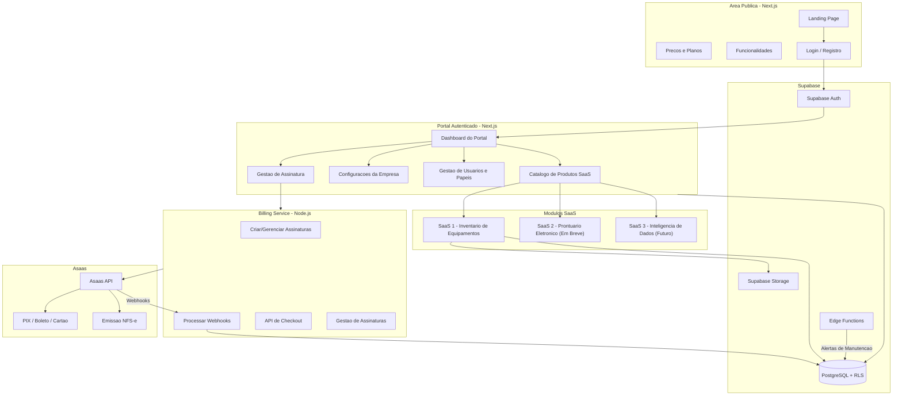
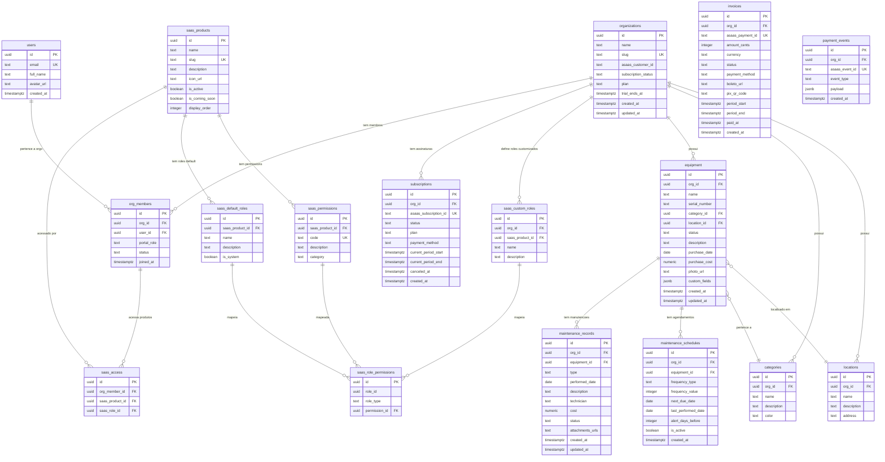
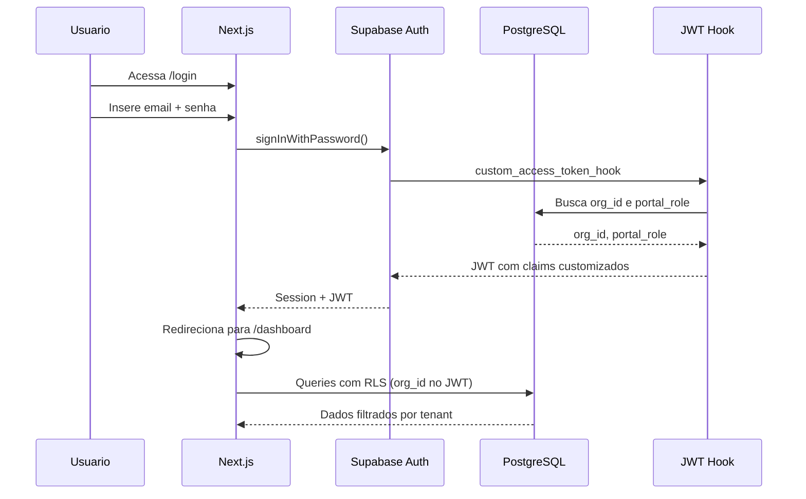
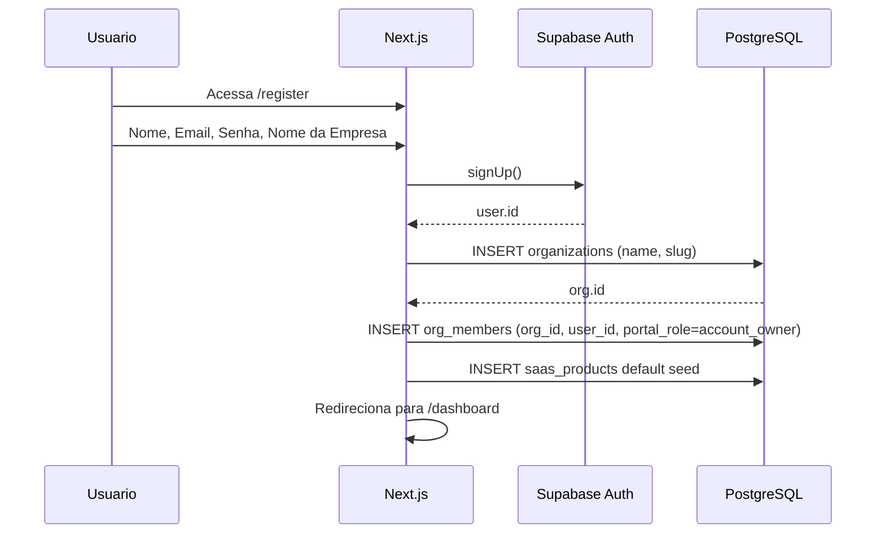
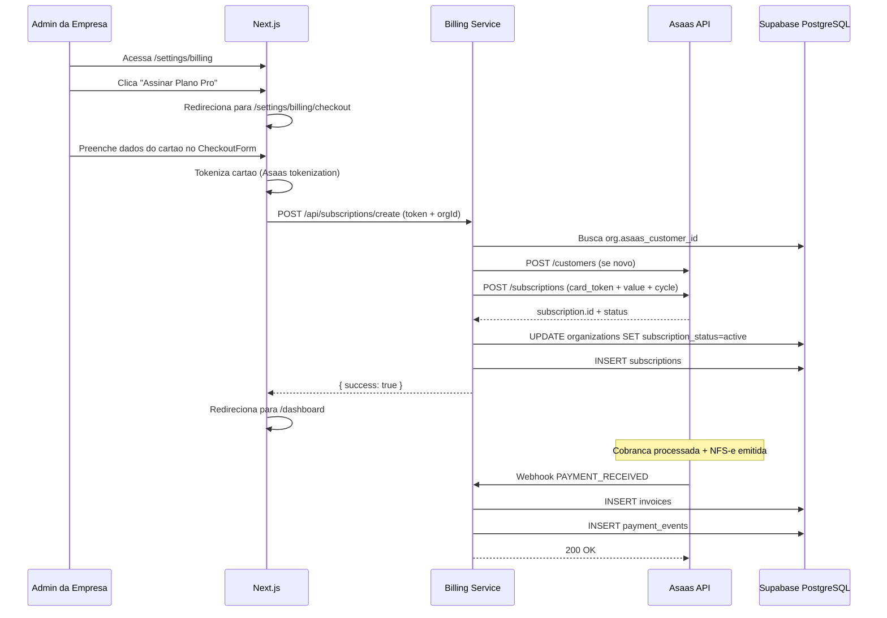
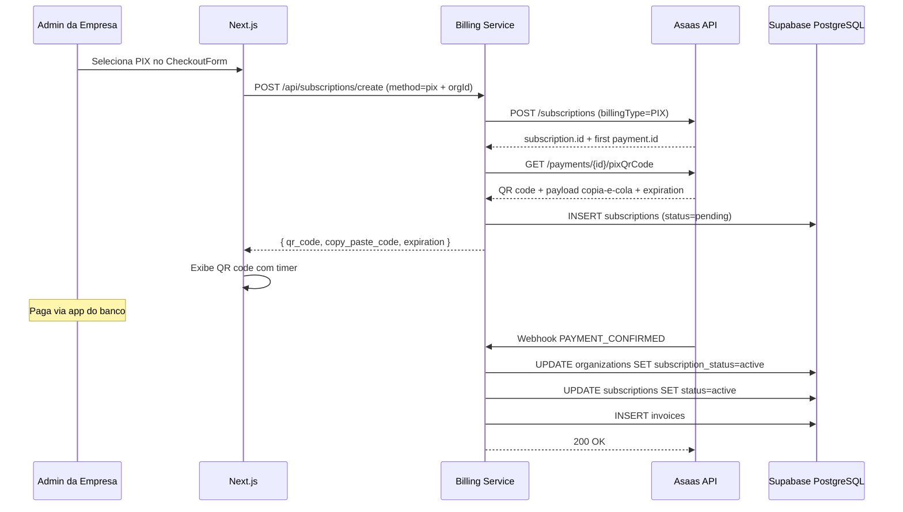
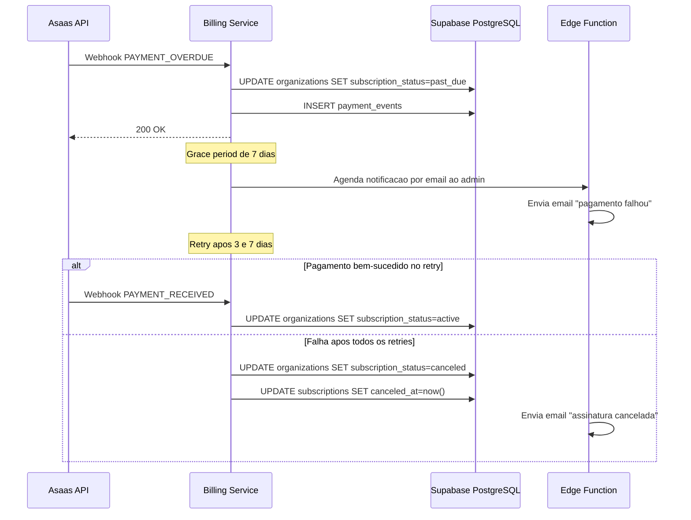

# Portal SaaS Multi-Produto — Arquitetura

## 1. Visao Geral do Sistema



### 1.1 Etapas de desenvolvimento (onde esta o roteiro)

O **plano macro por fases** (0 a 5), o resumo **planejado x executado**, **mapa de etapas**, **dependencias** e **pos-MVP** estao no **[DEVELOPMENT_PLAN.md](./DEVELOPMENT_PLAN.md)**, na secao **Etapas de desenvolvimento (visao geral)** (inclui as tabelas *Executado* e *Planejado mas pendente*). As tarefas detalhadas continuam nas secoes de cada fase no mesmo documento.

---

## 2. Camadas do Sistema

### 2.1. Frontend — Next.js

Aplicacao unica Next.js servindo area publica e area autenticada.

| Rota | Tipo | Descricao |
|------|------|-----------|
| `/` | Publica | Landing page com proposta de valor |
| `/features` | Publica | Detalhamento das funcionalidades |
| `/pricing` | Publica | Planos e precos |
| `/login` | Publica | Login com Supabase Auth |
| `/register` | Publica | Registro + criacao de organizacao |
| `/forgot-password` | Publica | Recuperacao de senha |
| `/dashboard` | Autenticada | Dashboard do portal com catalogo de SaaS |
| `/settings` | Autenticada | Configuracoes da empresa (admin) |
| `/settings/users` | Autenticada | Gestao de usuarios e papeis (admin) |
| `/settings/billing` | Autenticada | Gestao de assinatura (admin) |
| `/equipment` | Autenticada | Lista de equipamentos (SaaS #1) |
| `/equipment/[id]` | Autenticada | Detalhe do equipamento |
| `/equipment/new` | Autenticada | Cadastro de equipamento |
| `/maintenance` | Autenticada | Registros de manutencao |
| `/maintenance/schedules` | Autenticada | Agendamentos recorrentes |
| `/reports` | Autenticada | Relatorios e dashboards |

### 2.2. Billing Service — Node.js / TypeScript

Microservico separado responsavel exclusivamente por billing. Nao processa logica de negocio dos SaaS.

**Endpoints:**

| Metodo | Rota | Descricao |
|--------|------|-----------|
| POST | `/api/subscriptions/create` | Cria customer (se necessario) e assinatura no gateway ativo |
| POST | `/api/subscriptions/cancel` | Cancela assinatura |
| POST | `/api/subscriptions/update-payment` | Atualiza metodo de pagamento |
| GET | `/api/subscriptions/status/:orgId` | Consulta status da assinatura |
| GET | `/api/subscriptions/invoices/:orgId` | Lista cobrancas da organizacao |
| POST | `/api/webhooks/asaas` | Recebe webhooks do Asaas (alternativa ao Edge Function) |
| `POST` | Edge Function `asaas-webhook` | URL `https://<ref>.supabase.co/functions/v1/asaas-webhook` — recebe webhooks Asaas com HTTPS publico; `verify_jwt = false`; secret `ASAAS_WEBHOOK_TOKEN`. Catalogo de eventos habilitados no painel e divisao *dominio vs auditoria*: [DEVELOPMENT_PLAN.md](./DEVELOPMENT_PLAN.md) (*Eventos habilitados no Asaas*). |
| POST | `/api/webhooks/pagarme` | Recebe postbacks da Pagar.me (modo backup) |
| GET | `/api/subscriptions/provider` | Retorna gateway ativo (`asaas` ou `pagarme`) |

`POST /api/subscriptions/create` aceita `paymentMethod`: `credit_card`, `boleto` ou `pix`. **PIX em assinatura** esta implementado apenas no adaptador **Asaas** (`billingType: PIX` + `GET /payments/{id}/pixQrCode`); com `BILLING_PROVIDER=pagarme` o servico responde erro explicativo. A resposta JSON pode incluir `pix_qr_code` e `pix_copy_paste` quando o QR for obtido na hora.

### 2.2.1 Arquitetura hexagonal (billing plugavel)

O `apps/billing-service` segue **arquitetura hexagonal** para trocar o provedor de pagamento sem alterar regras de negocio nem o contrato HTTP do servico.

| Camada | Papel |
|--------|--------|
| **Dominio** | Tipos neutros (`BillingDomainEvent`, `CreateSubscriptionInput`, etc.) |
| **Porta `BillingGatewayPort`** | Contrato que qualquer gateway deve implementar: criar cliente, criar/cancelar assinatura, atualizar cartao |
| **Porta `BillingPersistencePort`** | Contrato de persistencia (organizacao, assinaturas, faturas, eventos) |
| **Adaptador Asaas** | Implementacao padrao (`BILLING_PROVIDER=asaas`) — REST v3 |
| **Adaptador Pagar.me** | Implementacao alternativa (`BILLING_PROVIDER=pagarme`) — REST core v5 |
| **Adaptador Supabase** | Implementa persistencia; colunas legadas `stripe_*` armazenam IDs externos de qualquer gateway |
| **Caso de uso** | `BillingApplication` orquestra fluxos; webhooks mapeiam payload do provedor para `BillingDomainEvent` e aplicam na persistencia |

**Selecao do provedor:** variavel de ambiente `BILLING_PROVIDER` (`asaas` padrao ou `pagarme`). Reiniciar o servico apos alterar.

**Responsabilidades:**
- Criar e gerenciar customers e assinaturas via Asaas API
- Processar webhooks (PAYMENT_RECEIVED, PAYMENT_OVERDUE, PAYMENT_REFUNDED, etc.)
- Gerar cobrancas via PIX (QR code), boleto e cartao tokenizado
- Atualizar status da organizacao no Supabase
- Registrar historico de cobrancas e eventos de pagamento
- Implementar dunning (retry de cobranca em caso de falha)
- Fila de retry para webhooks com falha
- NFS-e emitida automaticamente pelo Asaas apos pagamento

### 2.3. Supabase

| Servico | Uso |
|---------|-----|
| Auth | Autenticacao (email/senha, magic link, OAuth futuro) |
| PostgreSQL | Banco de dados principal com RLS |
| Storage | Fotos de equipamentos, anexos de manutencao |
| Edge Functions | Cron de alertas de manutencao, notificacoes |
| Realtime | Dashboard ao vivo (futuro) |

### 2.4. Asaas

| Recurso | Uso |
|---------|-----|
| Customers API | Cadastro de clientes com CPF/CNPJ para cobranca e NFS-e |
| Subscriptions API | Assinaturas recorrentes com cobranca automatica |
| Payments API | Cobrar via PIX, boleto ou cartao tokenizado |
| Tokenizacao | Tokenizacao de cartao no frontend (PCI compliance) |
| Webhooks | Notificacao de eventos (PAYMENT_RECEIVED, PAYMENT_OVERDUE, etc.) |
| PIX | Geracao de QR code e cobranca instantanea (D+1) |
| Boleto | Geracao de boleto bancario com codigo de barras e linha digitavel |
| Cartao de Credito | Cobranca recorrente tokenizada |
| NFS-e | Emissao automatica de nota fiscal de servico apos pagamento |
| Conta Digital | Saldo, transferencias e gestao financeira integrada |

### 2.5. Checkout Transparente (UI propria)

Como o Asaas nao oferece checkout hosted nem customer portal, o sistema implementa:

| Componente | Descricao |
|-----------|-----------|
| `<CheckoutForm>` | Formulario de pagamento embarcado: selecao PIX/boleto/cartao, tokenizacao |
| `/settings/billing` | Portal de assinatura proprio: status, faturas, troca de metodo, cancelamento |
| `/settings/billing/checkout` | Pagina de checkout com resumo do plano e formulario de pagamento |
| Dunning service | Logica de retry e escalonamento de inadimplencia (past_due → unpaid → canceled) |

---

## 3. Sistema de Permissoes — RBAC Dual

O sistema de permissoes e dividido em dois dominios independentes:

### 3.1. Portal Roles (Conta / Assinatura)

Controlam quem gerencia a conta, billing e usuarios. Sao poucos, fixos, e independem dos SaaS contratados.

| Portal Role | Gerenciar Assinatura | Gerenciar Usuarios | Ver Faturas | Descricao |
|-------------|---------------------|--------------------|-------------|-----------|
| `account_owner` | Sim | Sim | Sim | Criador da conta. Unico por org. |
| `account_admin` | Sim | Sim | Sim | Co-administrador da conta. |
| `billing_viewer` | Nao | Nao | Sim | Ve faturas, sem poder de gestao. |
| `member` | Nao | Nao | Nao | Membro comum. Acesso definido por SaaS Roles. |

Um usuario com portal_role `account_owner` pode nao ter acesso a nenhum SaaS — ele so paga a conta.

### 3.2. SaaS Roles e Permissions (Produto)

Controlam o que o usuario pode fazer dentro de cada produto SaaS. Sao granulares, flexiveis, e customizaveis por empresa.

**Permissions do SaaS #1 — Inventario de Equipamentos:**

| Codigo | Descricao |
|--------|-----------|
| `equipment.view` | Visualizar lista e detalhes de equipamentos |
| `equipment.create` | Cadastrar novos equipamentos |
| `equipment.edit` | Editar equipamentos existentes |
| `equipment.delete` | Remover equipamentos |
| `category.manage` | Criar, editar e remover categorias |
| `location.manage` | Criar, editar e remover localizacoes |
| `maintenance.view` | Visualizar registros de manutencao |
| `maintenance.create` | Registrar manutencoes realizadas |
| `maintenance.edit` | Editar registros de manutencao |
| `maintenance.delete` | Remover registros de manutencao |
| `schedule.view` | Visualizar agendamentos de manutencao |
| `schedule.manage` | Criar, editar e remover agendamentos |
| `reports.view` | Acessar relatorios e dashboards |

**Roles default do SaaS #1:**

| SaaS Role | Permissions |
|-----------|-------------|
| `saas_admin` | Todas as permissions do produto |
| `manager` | Todas exceto `*.delete` |
| `operator` | `equipment.view`, `equipment.create`, `equipment.edit`, `maintenance.view`, `maintenance.create`, `maintenance.edit`, `schedule.view` |
| `viewer` | `equipment.view`, `maintenance.view`, `schedule.view`, `reports.view` |

**Roles customizaveis:** cada empresa pode criar roles proprios com combinacao livre de permissions. Ex: "Tecnico Senior" com `maintenance.delete` mas sem `equipment.delete`.

### 3.3. Exemplo pratico

```
Empresa "Fabrica XYZ" — 5 usuarios:

Carlos (dono da empresa)
  Portal Role: account_owner
  SaaS Access: nenhum (so paga a conta)

Maria (gerente de manutencao)
  Portal Role: member
  SaaS Access: Inventario → saas_admin

Joao (tecnico)
  Portal Role: member
  SaaS Access: Inventario → operator

Ana (estagiaria)
  Portal Role: member
  SaaS Access: Inventario → viewer

Pedro (financeiro)
  Portal Role: billing_viewer
  SaaS Access: nenhum (so consulta faturas)
```

### 3.4. Extensibilidade para novos SaaS

Quando o SaaS #2 (Prontuario) for lancado:
- Novas `saas_permissions` sao criadas (`patient.view`, `prescription.create`, etc.)
- Novos `saas_roles` default sao criados para o produto Prontuario
- Cada empresa define quem acessa o Prontuario e com qual papel
- Zero mudanca no sistema de Portal Roles
- Maria pode ser `saas_admin` no Inventario e `viewer` no Prontuario

---

## 4. Modelo de Dados

### 4.1. Diagrama ER



### 4.2. Detalhamento das Tabelas

#### organizations
Representa um tenant (empresa cliente). Toda query de dados filtra por `org_id`.

| Campo | Tipo | Descricao |
|-------|------|-----------|
| `id` | uuid PK | Identificador unico |
| `name` | text | Nome da empresa |
| `slug` | text UNIQUE | Slug para URL (ex: fabrica-xyz) |
| `asaas_customer_id` | text | ID do cliente no Asaas |
| `subscription_status` | text | `trialing`, `active`, `past_due`, `canceled`, `unpaid` |
| `plan` | text | `free`, `starter`, `pro`, `enterprise` |
| `trial_ends_at` | timestamptz | Fim do periodo de trial |
| `created_at` | timestamptz | Data de criacao |
| `updated_at` | timestamptz | Ultima atualizacao |

#### org_members
Vincula usuarios a organizacoes com um portal_role.

| Campo | Tipo | Descricao |
|-------|------|-----------|
| `id` | uuid PK | Identificador unico |
| `org_id` | uuid FK | Organizacao |
| `user_id` | uuid FK | Usuario (Supabase Auth) |
| `portal_role` | text | `account_owner`, `account_admin`, `billing_viewer`, `member` |
| `status` | text | `active`, `invited`, `suspended` |
| `joined_at` | timestamptz | Data de entrada |

UNIQUE constraint em `(org_id, user_id)`.

#### saas_products
Catalogo de produtos SaaS disponiveis no portal.

| Campo | Tipo | Descricao |
|-------|------|-----------|
| `id` | uuid PK | Identificador unico |
| `name` | text | Nome do produto (ex: "Inventario de Equipamentos") |
| `slug` | text UNIQUE | Slug (ex: `equipment-inventory`) |
| `description` | text | Descricao para o catalogo |
| `icon_url` | text | Icone do produto |
| `is_active` | boolean | Produto disponivel para uso |
| `is_coming_soon` | boolean | Exibir como "Em Breve" no catalogo |
| `display_order` | integer | Ordem de exibicao |

#### saas_access
Define qual membro tem acesso a qual produto SaaS, e com qual papel.

| Campo | Tipo | Descricao |
|-------|------|-----------|
| `id` | uuid PK | Identificador unico |
| `org_member_id` | uuid FK | Membro da organizacao |
| `saas_product_id` | uuid FK | Produto SaaS |
| `saas_role_id` | uuid | ID do role (default ou custom) |

UNIQUE constraint em `(org_member_id, saas_product_id)`.

#### saas_role_permissions
Tabela associativa que mapeia roles a permissions. Suporta tanto roles default (do sistema) quanto roles customizados (da empresa).

| Campo | Tipo | Descricao |
|-------|------|-----------|
| `id` | uuid PK | Identificador unico |
| `role_id` | uuid | ID do role (default ou custom) |
| `role_type` | text | `default` ou `custom` |
| `permission_id` | uuid FK | ID da permission |

#### equipment
Equipamentos cadastrados pela empresa.

| Campo | Tipo | Descricao |
|-------|------|-----------|
| `id` | uuid PK | Identificador unico |
| `org_id` | uuid FK | Organizacao (tenant) |
| `name` | text | Nome do equipamento |
| `serial_number` | text | Numero de serie |
| `category_id` | uuid FK | Categoria |
| `location_id` | uuid FK | Localizacao |
| `status` | text | `active`, `inactive`, `maintenance`, `decommissioned` |
| `description` | text | Descricao / observacoes |
| `purchase_date` | date | Data de aquisicao |
| `purchase_cost` | numeric | Custo de aquisicao |
| `photo_url` | text | URL da foto no Supabase Storage |
| `custom_fields` | jsonb | Campos customizados da empresa |
| `created_at` | timestamptz | Data de criacao |
| `updated_at` | timestamptz | Ultima atualizacao |

#### maintenance_records
Registros de manutencoes realizadas em equipamentos.

| Campo | Tipo | Descricao |
|-------|------|-----------|
| `id` | uuid PK | Identificador unico |
| `org_id` | uuid FK | Organizacao (tenant) |
| `equipment_id` | uuid FK | Equipamento |
| `type` | text | `preventive`, `corrective`, `predictive` |
| `performed_date` | date | Data de realizacao |
| `description` | text | Descricao do servico |
| `technician` | text | Tecnico responsavel |
| `cost` | numeric | Custo da manutencao |
| `status` | text | `completed`, `in_progress`, `scheduled` |
| `attachments_urls` | text[] | URLs dos anexos |
| `created_at` | timestamptz | Data de criacao |
| `updated_at` | timestamptz | Ultima atualizacao |

#### maintenance_schedules
Agendamentos recorrentes de manutencao preventiva.

| Campo | Tipo | Descricao |
|-------|------|-----------|
| `id` | uuid PK | Identificador unico |
| `org_id` | uuid FK | Organizacao (tenant) |
| `equipment_id` | uuid FK | Equipamento |
| `frequency_type` | text | `days`, `weeks`, `months` |
| `frequency_value` | integer | Valor da frequencia (ex: 30 dias) |
| `next_due_date` | date | Proxima data de manutencao |
| `last_performed_date` | date | Ultima manutencao realizada |
| `alert_days_before` | integer | Dias de antecedencia para alerta |
| `is_active` | boolean | Agendamento ativo |
| `created_at` | timestamptz | Data de criacao |

---

## 5. Row Level Security (RLS)

Todas as tabelas com dados de tenant possuem RLS habilitado. O `org_id` do usuario autenticado e extraido do JWT via claim customizado.

### 5.1. Claim customizado no JWT (`custom_access_token_hook`)

**Problema:** politicas RLS usam `auth.jwt()->>'org_id'` para saber o tenant. O Supabase Auth **nao** le a tabela `org_members` sozinho: sem um passo extra, esses claims **nao existem** no JWT e o isolamento por org quebra (ou o cliente precisaria enviar `org_id` manualmente, o que e inseguro).

**Solucao:** um **Auth Hook** do tipo *Custom Access Token* roda **antes de cada emissao/refresh** do access token. Uma funcao Postgres (`public.custom_access_token_hook`) recebe o evento com `user_id` e `claims`, busca a linha ativa em `org_members` e **injeta** `org_id` e `portal_role` no objeto `claims` devolvido. Assim, qualquer chamada com o JWT do usuario carrega o tenant para o Postgres aplicar RLS.

#### Explicacao em linguagem simples

Imagine o **JWT** como um **cracha** digital que o app envia em toda requisicao ao banco. O **Postgres**, ao avaliar o RLS, so consegue “ler” o que esta **escrito nesse cracha** (funcao `auth.jwt()`). Ele **nao** faz um `JOIN` automatico com `org_members` por magica.

- **Sem o hook:** o cracha traz sobretudo quem e o usuario (`sub`, email, `role` authenticated, etc.), mas **nao** traz “qual organizacao ele representa agora”. As policies que comparam `org_id` da linha com `auth.jwt()->>'org_id'` **nao tem** esse valor — o isolamento por tenant falha ou voce seria forcado a mandar `org_id` do navegador, o que o usuario poderia falsificar.
- **Com o hook:** no instante em que o Auth **vai emitir** (ou **renovar**) o access token, ele chama a funcao `custom_access_token_hook`. Essa funcao olha na tabela **`org_members`**: “este `user_id` tem membership **active** em qual `org_id` e com qual `portal_role`?” e **grava essas respostas dentro do JWT** como claims extras. A partir dai, toda query autenticada leva o tenant no cracha e o RLS pode comparar com seguranca.

**Quem chama o hook:** o servico **Supabase Auth** (GoTrue), nao o seu frontend. O Next.js apenas recebe o token ja “carimbado”.

**Local vs nuvem:** a **funcao SQL** vive no banco (migration). O **Auth** precisa estar **configurado para usar** essa funcao: no **local** isso esta no `config.toml`; no **projeto hospedado**, tambem e preciso ligar o hook no **Dashboard** (senao o Auth ignora a funcao mesmo ela existindo).

#### Sequencia no login (resumo)

1. Usuario envia email/senha (ou outro metodo) ao Auth.
2. Auth valida credenciais.
3. Antes de devolver o access token, Auth chama `public.custom_access_token_hook` com `user_id` e claims atuais.
4. A funcao consulta `org_members` (`status = 'active'`) e, se encontrar, acrescenta `org_id` e `portal_role` aos claims.
5. Auth assina o JWT com esses claims e entrega ao cliente.
6. O cliente (Supabase JS, etc.) envia esse JWT nas chamadas ao Postgres; o RLS le `auth.jwt()->>'org_id'` e aplica isolamento.

**Implementacao no repo**

| Artefato | Papel |
|----------|--------|
| `supabase/migrations/010_custom_access_token_hook.sql` | Cria a funcao com `SECURITY DEFINER`, `search_path = public`, e concede `EXECUTE` apenas a `supabase_auth_admin` (exigencia do Auth). |
| `supabase/config.toml` → `[auth.hook.custom_access_token]` | **Ambiente local (`supabase start`):** aponta o Auth para a funcao Postgres `pg-functions://postgres/public/custom_access_token_hook`. |

#### Como executar (onde clicar e em que ordem)

**1) Achar o ID do projeto (ref)**  
No [Dashboard Supabase](https://supabase.com/dashboard), abra o projeto. O **project ref** aparece na URL ao navegar dentro dele, no formato:

`https://supabase.com/dashboard/project/<PROJECT_REF>/...`

Exemplo: se a URL for `https://supabase.com/dashboard/project/abcdxyz123/editor`, entao `PROJECT_REF` = `abcdxyz123`. Tambem em **Project Settings** (icone de engrenagem) → **General** → **Reference ID**.

**2) Link direto para a tela de Hooks (nuvem)**  
Abra no navegador (substitua `<PROJECT_REF>`):

`https://supabase.com/dashboard/project/<PROJECT_REF>/auth/hooks`

Documentacao oficial do fluxo: [Auth Hooks](https://supabase.com/docs/guides/auth/auth-hooks) (secao *Deploying*: *Authentication > Hooks*).

**3) Criar a funcao no banco **antes** de ligar o hook**  
Sem a funcao no Postgres, o painel nao tera o que selecionar ou o Auth falhara ao chamar.

- **Opcao A — CLI (recomendado):** na raiz do monorepo, com [Supabase CLI](https://supabase.com/docs/guides/cli) logado e linkado ao projeto remoto:
  - `supabase link --project-ref <PROJECT_REF>`
  - `supabase db push`  
  Isso aplica as migrations, inclusive `010_custom_access_token_hook.sql`.

- **Opcao B — SQL Editor no Dashboard:** **SQL Editor** → New query → copiar o conteudo completo de `supabase/migrations/010_custom_access_token_hook.sql` → **Run**. (Mesmo efeito que a migration, se ainda nao existir a funcao.)

**4) Ativar o hook na tela Hooks**  
Na URL `/auth/hooks` do passo 2:

1. Localize o bloco **Custom Access Token** (ou lista de hooks; o nome pode ser exatamente *Custom Access Token* na documentacao).
2. **Ative** o hook (toggle *Enable* / *Enabled*, conforme a UI).
3. Tipo de implementacao: escolha **Postgres** / **Database function** / **SQL** (o rotulo varia; **nao** escolha HTTP/Edge Function para este projeto).
4. **Schema:** `public`.
5. **Funcao:** `custom_access_token_hook` (nome exato da migration).
6. Salve / confirme as alteracoes.

Se nao aparecer a funcao no dropdown, volte ao passo 3 e confira no **SQL Editor** com:

`select proname from pg_proc join pg_namespace n on n.oid = pronamespace where n.nspname = 'public' and proname = 'custom_access_token_hook';`

**5) Validar**  
Faca **logout** e **login** de novo (ou refresh de sessao). Decodifique o access token (ex.: [jwt.io](https://jwt.io)) e confira se existem claims **`org_id`** e **`portal_role`** para um usuario com linha `active` em `org_members`.

**Ambiente local (`supabase start`)**  
1. Docker Desktop rodando.  
2. Na pasta `supabase/`, o `config.toml` ja contem `[auth.hook.custom_access_token]` com `uri = "pg-functions://postgres/public/custom_access_token_hook"`.  
3. `supabase start` (ou `supabase db reset` para aplicar migrations do zero).  
4. Nao existe a mesma tela de Hooks do hosted no Studio local da mesma forma: a configuracao e **so** o `config.toml`.

**Se ainda nao achar o menu:** use sempre o link direto do passo 2. Em alguns layouts, **Authentication** fica na barra lateral esquerda; **Hooks** pode ser uma **subsecao** dentro de Authentication (role a pagina ou use a URL).

**Detalhe:** se um usuario tiver mais de uma org (varias linhas em `org_members`), a funcao usa a **primeira** por `joined_at` (ordem deterministica); um modelo de “org ativa” no futuro pode refinar isso.

SQL fonte: ver `supabase/migrations/010_custom_access_token_hook.sql`.

### 5.2. Policies de isolamento por tenant

```sql
-- Habilitar RLS em todas as tabelas de dados
ALTER TABLE equipment ENABLE ROW LEVEL SECURITY;
ALTER TABLE categories ENABLE ROW LEVEL SECURITY;
ALTER TABLE locations ENABLE ROW LEVEL SECURITY;
ALTER TABLE maintenance_records ENABLE ROW LEVEL SECURITY;
ALTER TABLE maintenance_schedules ENABLE ROW LEVEL SECURITY;

-- Policy padrao: usuario so ve dados da sua organizacao
CREATE POLICY "tenant_isolation" ON equipment
  FOR ALL USING (
    org_id = (auth.jwt()->>'org_id')::uuid
  );

CREATE POLICY "tenant_isolation" ON categories
  FOR ALL USING (
    org_id = (auth.jwt()->>'org_id')::uuid
  );

CREATE POLICY "tenant_isolation" ON locations
  FOR ALL USING (
    org_id = (auth.jwt()->>'org_id')::uuid
  );

CREATE POLICY "tenant_isolation" ON maintenance_records
  FOR ALL USING (
    org_id = (auth.jwt()->>'org_id')::uuid
  );

CREATE POLICY "tenant_isolation" ON maintenance_schedules
  FOR ALL USING (
    org_id = (auth.jwt()->>'org_id')::uuid
  );
```

### 5.3. Policy de assinatura ativa

```sql
-- Bloquear acesso se a assinatura nao esta ativa ou em trial
CREATE POLICY "active_subscription_only" ON equipment
  FOR ALL USING (
    org_id IN (
      SELECT id FROM organizations
      WHERE id = (auth.jwt()->>'org_id')::uuid
        AND subscription_status IN ('active', 'trialing')
    )
  );
```

### 5.4. Controle granular de permissoes (aplicado no backend/frontend)

O RLS garante isolamento por tenant. O controle granular de permissoes (ex: "pode apagar equipamentos?") e verificado na camada de aplicacao (middleware Next.js + hooks React) consultando `saas_access` + `saas_role_permissions`.

```sql
-- Funcao helper para verificar permissao do usuario
CREATE OR REPLACE FUNCTION public.has_permission(
  p_user_id uuid,
  p_org_id uuid,
  p_product_slug text,
  p_permission_code text
)
RETURNS boolean LANGUAGE plpgsql SECURITY DEFINER AS $$
DECLARE
  has_perm boolean;
BEGIN
  SELECT EXISTS (
    SELECT 1
    FROM saas_access sa
    JOIN org_members om ON om.id = sa.org_member_id
    JOIN saas_products sp ON sp.id = sa.saas_product_id
    JOIN saas_role_permissions srp ON srp.role_id = sa.saas_role_id
    JOIN saas_permissions p ON p.id = srp.permission_id
    WHERE om.user_id = p_user_id
      AND om.org_id = p_org_id
      AND sp.slug = p_product_slug
      AND p.code = p_permission_code
  ) INTO has_perm;

  RETURN has_perm;
END;
$$;
```

---

## 6. Fluxo de Autenticacao



### 6.1. Registro de nova empresa



---

## 7. Fluxo de Pagamento

### 7.1. Fluxo de pagamento via Cartao



### 7.2. Fluxo de pagamento via PIX



### 7.3. Fluxo de falha de pagamento (dunning)



---

## 8. Estrutura do Projeto (Monorepo)

```
portal-saas/
├── apps/
│   ├── web/                          # Next.js frontend
│   │   ├── app/
│   │   │   ├── (public)/             # Rotas publicas
│   │   │   │   ├── page.tsx          # Landing page
│   │   │   │   ├── features/
│   │   │   │   ├── pricing/
│   │   │   │   └── layout.tsx
│   │   │   ├── (auth)/               # Rotas de autenticacao
│   │   │   │   ├── login/
│   │   │   │   ├── register/
│   │   │   │   └── forgot-password/
│   │   │   ├── (portal)/             # Rotas autenticadas
│   │   │   │   ├── dashboard/
│   │   │   │   ├── settings/
│   │   │   │   │   ├── page.tsx      # Config geral
│   │   │   │   │   ├── users/        # Gestao de usuarios
│   │   │   │   │   └── billing/      # Gestao de assinatura
│   │   │   │   ├── equipment/        # SaaS #1
│   │   │   │   │   ├── page.tsx      # Lista
│   │   │   │   │   ├── [id]/         # Detalhe
│   │   │   │   │   └── new/          # Cadastro
│   │   │   │   ├── maintenance/
│   │   │   │   │   ├── page.tsx      # Registros
│   │   │   │   │   └── schedules/    # Agendamentos
│   │   │   │   ├── reports/
│   │   │   │   └── layout.tsx        # Layout com sidebar + auth guard
│   │   │   └── api/                  # API routes minimas
│   │   │       └── auth/
│   │   │           └── callback/     # OAuth callback
│   │   ├── components/
│   │   │   ├── ui/                   # Componentes base (shadcn/ui)
│   │   │   ├── portal/              # Componentes do portal
│   │   │   ├── equipment/           # Componentes do SaaS #1
│   │   │   └── billing/             # Componentes de billing
│   │   │       ├── checkout-form.tsx  # Formulario de pagamento (PIX/boleto/cartao)
│   │   │       ├── pix-payment.tsx    # QR code PIX com timer
│   │   │       ├── boleto-payment.tsx # Exibicao de boleto
│   │   │       ├── card-form.tsx      # Formulario de cartao com tokenizacao
│   │   │       ├── subscription-status.tsx  # Status da assinatura
│   │   │       └── invoice-history.tsx      # Historico de faturas
│   │   ├── hooks/
│   │   │   ├── use-auth.ts
│   │   │   ├── use-permissions.ts
│   │   │   └── use-organization.ts
│   │   ├── lib/
│   │   │   ├── supabase/
│   │   │   │   ├── client.ts         # Browser client
│   │   │   │   ├── server.ts         # Server client
│   │   │   │   └── middleware.ts     # Auth middleware
│   │   │   └── permissions.ts        # Verificacao de permissoes
│   │   ├── middleware.ts             # Next.js middleware (auth redirect)
│   │   ├── next.config.ts
│   │   ├── tailwind.config.ts
│   │   └── package.json
│   │
│   └── billing-service/              # Microservico de billing
│       ├── src/
│       │   ├── index.ts              # Entry point (Express/Fastify)
│       │   ├── routes/
│       │   │   ├── subscriptions.ts
│       │   │   └── webhooks.ts
│       │   ├── services/
│       │   │   ├── asaas.service.ts
│       │   │   ├── subscription.service.ts
│       │   │   └── dunning.service.ts
│       │   ├── middleware/
│       │   │   └── auth.ts           # Validacao JWT Supabase
│       │   └── types/
│       ├── Dockerfile
│       ├── tsconfig.json
│       └── package.json
│
├── packages/
│   └── shared/                       # Tipos e utils compartilhados
│       ├── src/
│       │   ├── types/
│       │   │   ├── organization.ts
│       │   │   ├── permissions.ts
│       │   │   └── equipment.ts
│       │   └── constants/
│       │       ├── portal-roles.ts
│       │       └── saas-permissions.ts
│       ├── tsconfig.json
│       └── package.json
│
├── supabase/
│   ├── migrations/                   # SQL migrations versionadas
│   │   ├── 001_organizations.sql
│   │   ├── 002_portal_roles.sql
│   │   ├── 003_saas_products.sql
│   │   ├── 004_saas_permissions.sql
│   │   ├── 005_equipment.sql
│   │   ├── 006_maintenance.sql
│   │   ├── 007_subscriptions.sql
│   │   ├── 008_rls_policies.sql
│   │   └── 009_seed_data.sql
│   ├── functions/
│   │   └── maintenance-alerts/       # Edge function de alertas
│   └── config.toml
│
├── docker-compose.yml                # Desenvolvimento local
├── turbo.json                        # Turborepo config
├── package.json                      # Monorepo root
├── ARCHITECTURE.md                   # Este documento
├── TECHNICAL_DECISIONS.md
├── DEVELOPMENT_PLAN.md
└── BusinessPlan.md
```

---

## 9. Hosting e Deploy

| Componente | Plataforma | Custo |
|------------|-----------|-------|
| Next.js Frontend | Vercel (Hobby) | $0 |
| Billing Service | Fly.io ou Render | $0 (free tier) |
| PostgreSQL + Auth + Storage | Supabase (Free) | $0 |
| Pagamentos | Asaas (plano gratuito) | Cartao ~2.99%; PIX ~R$0,49; Boleto ~R$1,99 por transacao |

### 9.1. Deploy pipeline

```
git push → GitHub
  ├── Vercel: auto-deploy do Next.js (apps/web)
  ├── Fly.io: auto-deploy do billing service (apps/billing-service)
  └── Supabase: migrations via supabase db push
```

---

## 10. Consideracoes de Seguranca

| Area | Implementacao |
|------|---------------|
| Autenticacao | Supabase Auth (bcrypt, JWT, refresh tokens) |
| Isolamento de dados | RLS por org_id em todas as tabelas |
| Permissoes | RBAC dual verificado no middleware e no frontend |
| Billing secrets | Asaas API key apenas no billing service (server-side) |
| Webhooks | Verificacao de access token do Asaas (asaas-access-token header) |
| Tokenizacao | Dados de cartao tokenizados no frontend via Asaas; billing service nunca recebe dados crus |
| HTTPS | Automatico (Vercel, Fly.io, Supabase) |
| Senhas | Gerenciadas pelo Supabase Auth (nao armazenadas pela aplicacao) |
| SQL Injection | Prevenido pelo Supabase SDK (queries parametrizadas) |

---

## 11. Evolucao futura — marketplace e repasse a provedores

O desenho atual assume **um operador do portal** cobrando **clientes finais** via uma conta Asaas. Para permitir que **terceiros** oferecam SaaS pelo mesmo portal com **repasse de receita**, existem dois modelos principais: **agregador** (liquida na plataforma e repassa depois) ou **split Asaas** (divisao automatica entre carteiras na API). Detalhes, riscos, dados e fases estao em [FUTURE_MARKETPLACE_SPLIT_STRATEGY.md](./FUTURE_MARKETPLACE_SPLIT_STRATEGY.md).

---

Ultima atualizacao: Marco 2026
